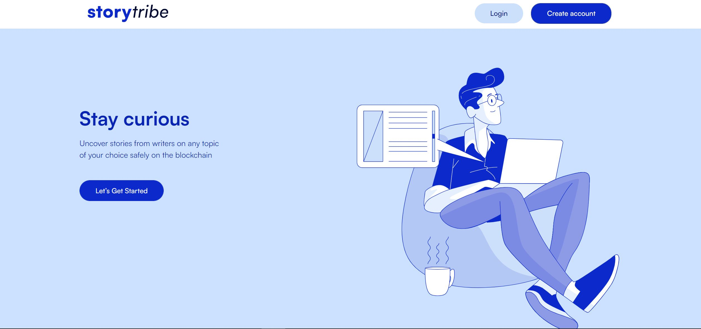
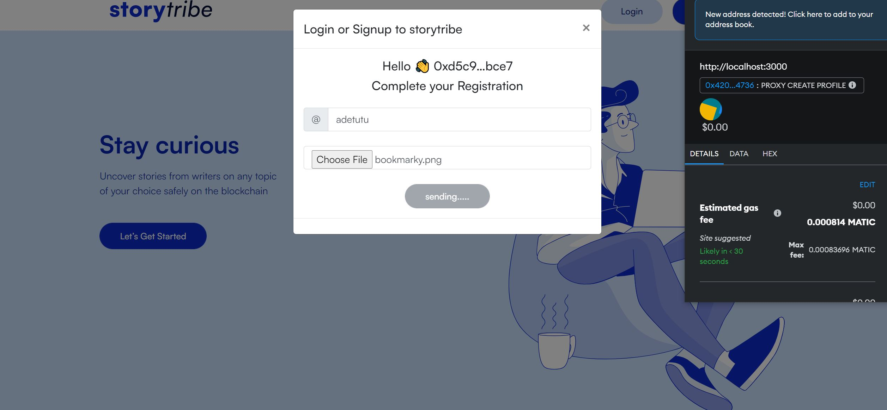
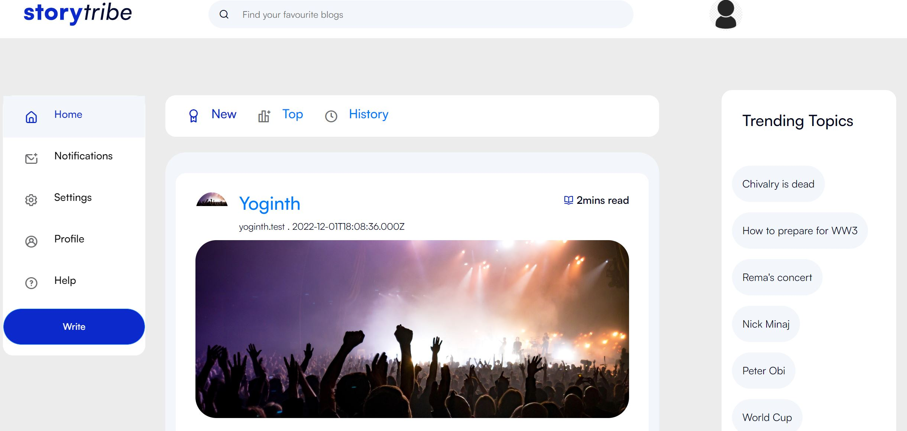

## A Blog Dapp integrated with lens protocol [Lens Protocol](https://www.lens.dev/),  

### Deployed network : Mumbai

- To create an account please ensure you have a matic testnet token to complete transaction

- Link: https://storybite.netlify.app/

### Tech Stack : NuxtJs, VueJs, Ethers, GraphQl, Html, Css, BootstrapVue

#### Available Features
        * Registration on the lens profile
        * Logging in to your profile
        * Link:Logging in to blog page to read blogs
        * Link:connecting to metamask

##### Currently working on
        * writing comment on post
        
#### Things to work on next
        * Link: Seaching through blogs
        * Link:Reaction to post
        
#### Screenshot of homepage, registration page & blog page shown below

